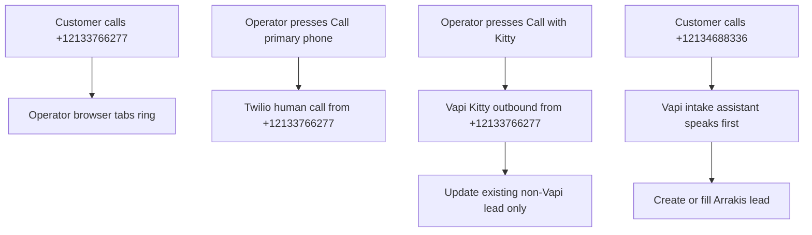
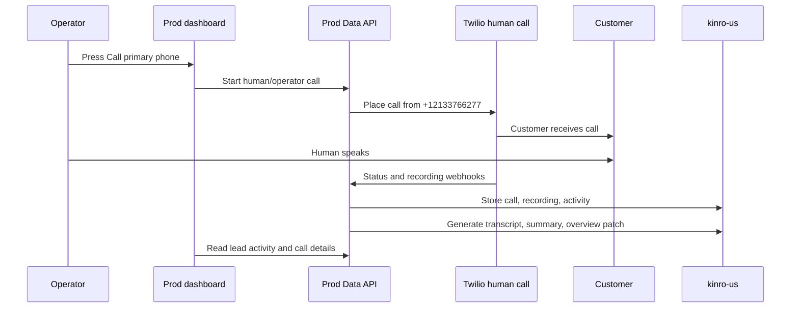
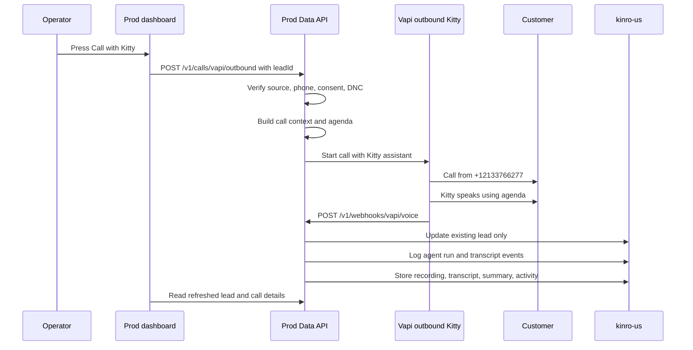
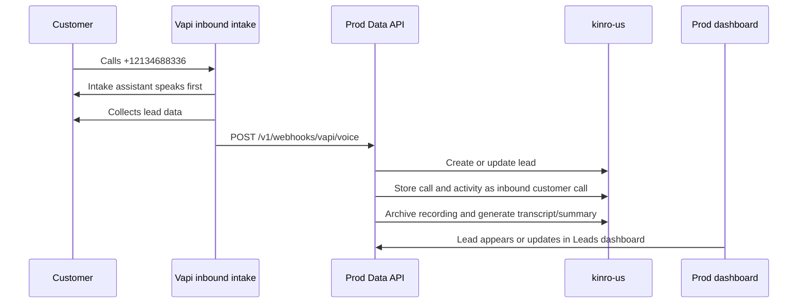
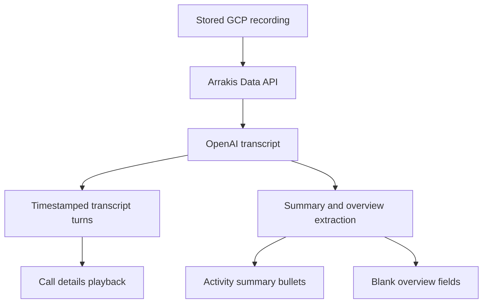
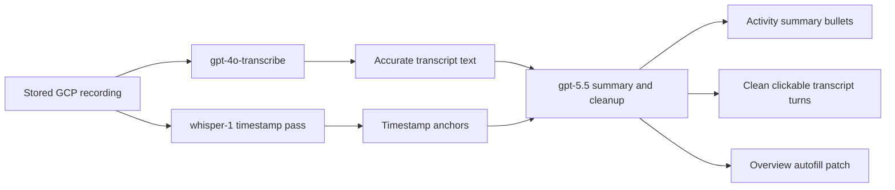

# Plan: Arrakis Production Voice Agents

Date: 2026-05-27
Status: Production planning

## Objective

Move the preview voice-agent flow into production while keeping the current
Arrakis dashboard and human calling behavior familiar.

Production should support three clear call paths:

- `Call primary phone`: human/operator call through Twilio.
- `Call with Kitty`: outbound AI call through Vapi.
- Inbound intake: customer calls a dedicated Vapi number and speaks directly to  
the intake assistant. This is for Mail campaign. 

All recorded calls should have the same operator experience:

- recording playback from the stored GCP recording;
- transcript turns;
- clickable transcript turns that seek the recording;
- summary bullets on lead activity;
- full recording/transcript on the call details page;
- transcript-derived overview autofill for blank lead fields only.

## Guardrails

- Do not deploy directly from a laptop.
- Deploy production changes only through pull requests and CI.
- Do not open a pull request unless explicitly asked.
- Do not change the database schema without first discussing the need and
proposed design.
- Do not copy preview Vapi IDs into production.
- Keep the first production version on existing Arrakis surfaces: leads,
activity, call details, recordings, and metadata.
- Backfill old calls only through a controlled production job.

## Current Production Reality

Arrakis already has the main pieces needed for production:

- Dashboard lead detail:
`apps/arrakis/dashboard/app/(app)/leads/[id]/page.tsx`
- Dashboard communication panel:
`apps/arrakis/dashboard/app/(app)/leads/[id]/components/communication-panel.tsx`
- Dashboard lead activity:
`apps/arrakis/dashboard/app/(app)/leads/[id]/components/lead-timeline.tsx`
- Dashboard call details:
`apps/arrakis/dashboard/app/(app)/calls/[id]/page.tsx`
- Agent run audit tables:
`arrakis.agent_runs` and `arrakis.agent_transcript_events`
- Data API routes:
`apps/arrakis/data_api/src/index.ts`
- Vapi projection and outbound call logic:
`apps/arrakis/data_api/src/operations/repository.ts`
- Vapi webhook handling:
`apps/arrakis/data_api/src/voice-providers/vapi-voice.ts`
- Transcription and summarization:
`apps/arrakis/data_api/src/twilio/post-call-summarization.ts`
- Recording archive and streaming:
`apps/arrakis/data_api/src/recordings/storage.ts`
and `apps/arrakis/data_api/src/twilio/client.ts`

Production environment facts:

- Dashboard: `ops.kinro.ai`
- Data API: `https://arrakis-data-api-965370637467.us-central1.run.app`
- Database: `kinro123:us-central1:kinro-us`
- Human-call Twilio app: `AP15f69836ebb91fb54061158e4f02db88`

## Production Numbers And Assistants

### Human Line

- Number: `+12133766277`
- Dashboard action: `Call primary phone`
- Provider: Twilio
- Speaker: human operator
- Inbound behavior: customer calls to this number should ring operator browser
tabs.
- Outbound behavior: when an operator presses `Call primary phone`, the human
call is placed from this number.

This path must stay separate from Vapi/Kitty and must not be disturbed by the
Vapi number import.

Verification already done:

- Twilio routing for `+12133766277` still points to production TwiML app
`AP15f69836ebb91fb54061158e4f02db88`.

### Outbound Kitty Line

- Number: `+12133766277`
- Vapi phone number name: `Arrakis Prod - Kitty`
- Vapi phone number ID: `fb3c5c67-be24-46cd-bf26-ae4b6df169e3`
- Dashboard action: `Call with Kitty`
- Provider: Vapi
- Assistant ID: `5bb25ea8-7af6-4686-8e69-a46f471d0c99`
- Server URL:
`https://arrakis-data-api-965370637467.us-central1.run.app/v1/webhooks/vapi/voice`

Behavior:

- Operator presses `Call with Kitty`.
- Vapi places an outbound call from `+12133766277`.
- Kitty speaks to the customer.
- Results attach to the existing lead only.

Eligibility:

- Show `Call with Kitty` only for leads from sources other than Vapi inbound or
Vapi mail campaign.
- Do not show it for Vapi-created inbound leads.
- Do not show it for Vapi mail-campaign leads.
- Do not allow it when the lead has no usable phone number.
- Do not allow it for do-not-contact contacts.
- Keep consent checks aligned between frontend and backend.
- Do not create a new lead from outbound Kitty results.

### Inbound Intake Line

- Number: `+12134688336`
- Vapi phone number name: `Kinro Arrakis Prod`
- Vapi phone number ID: `adf1a93a-973d-4eb9-8a60-ff7c8c3efbb2`
- Provider: Vapi
- Assistant ID: `da2c4fa9-cf48-4114-a57d-90991cd01896`
- Server URL:
`https://arrakis-data-api-965370637467.us-central1.run.app/v1/webhooks/vapi/voice`

Behavior:

- Customer calls `+12134688336`.
- The call goes directly to the Vapi intake assistant.
- Operator browser tabs must not ring for this number.
- The intake assistant should speak first.
- The assistant collects lead/business details.
- Arrakis creates or fills a lead in the production Leads dashboard.
- Activity should clearly show this as a customer inbound call.

Verification already done:

- `+12134688336` is attached directly to intake assistant
`da2c4fa9-cf48-4114-a57d-90991cd01896`.
- The phone and assistant both point to the production Vapi webhook.
- Assistant mode is `assistant-speaks-first-with-model-generated-message`.

## Routing Rules

These rules are the source of truth:

- Customer calls to `+12133766277` should ring operator browser tabs.
- Customer calls to `+12134688336` should go directly to Vapi intake.
- `Call primary phone` should place a human/operator Twilio call from
`+12133766277`.
- `Call with Kitty` should place a Vapi outbound AI call from `+12133766277`.
- `Call with Kitty` must never appear for Vapi inbound or Vapi mail-campaign
leads.




## Call Flows

### Pre-Call Context For Kitty

Before starting `Call with Kitty`, Arrakis should prepare a short context packet
for the assistant instead of treating the call as a blank intake.

Inputs:

- existing lead fields;
- source metadata;
- prior call transcripts and summaries when available;
- prior timeline notes when relevant;
- appetite-check output when available.

Purpose:

- give Kitty a specific agenda for the call;
- avoid asking for information Arrakis already has;
- focus the call on missing or unclear details;
- give the operator a clearer audit trail of why Kitty called.

If the appetite agent is not ready, the first production version can still build
the call context from the lead record, timeline, and existing transcripts. When
the appetite agent becomes available, its short summary should be added to the
same context packet.

### `Call Primary Phone`

1. Operator opens a production lead.
2. Operator presses `Call primary phone`.
3. Arrakis starts the existing Twilio human-call flow.
4. The call is placed from `+12133766277`.
5. A human operator speaks.
6. Recording is stored through the existing recording flow.
7. Activity shows the human/operator call.
8. Call details show recording playback and transcript artifacts when available.




### `Call With Kitty`

1. Operator opens an eligible production lead.
2. Operator presses `Call with Kitty`.
3. Arrakis checks source eligibility, phone, consent, and do-not-contact.
4. Arrakis builds a short context packet from existing lead/timeline/transcript
  information.
5. Arrakis starts a Vapi outbound call with assistant
  `5bb25ea8-7af6-4686-8e69-a46f471d0c99`.
6. Vapi calls from `+12133766277`.
7. Kitty speaks and uses the context packet as the call agenda.
8. Vapi sends webhooks to production Arrakis.
9. Arrakis updates the existing lead only.
10. Activity shows summary bullets and `View call details`.
11. Call details show recording playback and clickable transcript turns.

Outbound Vapi metadata should include:

```json
{
  "leadId": "...",
  "arrakisCallId": "...",
  "voiceFlow": "outbound_intake",
  "source": "vapi_voice",
  "callAgenda": "Short summary of known context and missing details"
}
```




### Inbound Intake

1. Customer calls `+12134688336`.
2. Vapi routes directly to assistant
  `da2c4fa9-cf48-4114-a57d-90991cd01896`.
3. Operator browser tabs do not ring.
4. The assistant speaks first and collects lead details.
5. Vapi sends webhooks to production Arrakis.
6. Arrakis creates a new lead or updates a matching lead according to the
  chosen matching policy.
7. Activity shows the inbound customer call.
8. Call details show recording playback and transcript artifacts when available.




## Kitty Voicemail

Voicemail is in scope for outbound Kitty calls.

Configured voicemail message:

```text
Hello this is kitty calling from Kinro. We shop insurance at cheaper prices for you. Please give us a call back when you are available.
```

Expected behavior:

- If Kitty reaches voicemail or an answering machine, Vapi should leave the
approved voicemail message.
- The voicemail outcome should attach to the existing lead only.
- Activity should show a concise voicemail note, such as that Kitty reached
voicemail and whether a message was left.
- Call details should still show recording and transcript when available.
- If no intake was collected, Arrakis should not overwrite lead overview fields.
- If the transcript contains useful non-personal business details, the normal
summary and overview-fill rules can still apply.

End-call requirement:

- After intake is complete or voicemail is left, Kitty must say the final goodbye
and end the call immediately.
- The Kitty assistant has `endCallMessage`, `endCallPhrases`, and the `endCall`
tool configured for this.

Verified Vapi end-call settings:

- `endCallMessage`: `Goodbye.`
- `endCallPhrases` include:
  - `Goodbye.`
  - `Goodbye`
  - `Perfect. We'll be in touch soon. Goodbye.`
  - `Perfect. We’ll be in touch soon. Goodbye.`
- `endCall` tool is enabled.

## Call Screening AI

Outbound Kitty should handle call-screening assistants that some customers use
before a human answers.

Expected behavior:

- If a call-screening AI asks who is calling, Kitty should give a short identity
and purpose statement.
- Example: "This is Kitty calling from Kinro about insurance quote details for
the business. Please connect me when available."
- Kitty should not treat the screening AI as the customer.
- Kitty should not persist business intake fields unless a human customer
provides or confirms them.
- If the call-screening AI does not connect the call, record the result as a
call-screen/no-answer style outcome on the existing lead.
- The recording, transcript, and summary should still appear on the call details
page when available.

## Recording, Transcript, Summary, And Overview

Production should match preview behavior.

Partial-call rule:

- If the customer hangs up or the call ends midway after giving only a few
  details, Arrakis should still keep the recording and generate/store the
  transcript.
- Activity should show whatever useful summary bullets can be produced from the
  partial transcript.
- Call details should still show the recording and transcript turns when
  available.
- Overview autofill should use only details that were clearly stated before the
  call ended.
- Incomplete calls should not erase or overwrite existing lead data.

Recording playback:

- Use the stored GCP recording, not temporary Vapi or Twilio browser URLs.
- Dashboard playback should go through:
  - `GET /v1/calls/:id/recording`
  - `GET /api/arrakis/calls/:id/recording`

Transcription and summary models:

- `gpt-4o-transcribe` for the highest-quality transcript text.
- `whisper-1` for timestamp anchors because it returns segment times for
click-to-play.
- `gpt-5.2` for summary bullets, cleaned transcript turns, speaker cleanup, and
lead overview extraction.

Model flow:


Activity summary rules:

- No paragraph summary.
- Maximum 5 bullets.
- Fewer than 5 bullets is fine when the call has less information.
- Include useful non-personal details.
- Do not include names, phone numbers, emails, or addresses.
- Do not invent facts.

Overview autofill:

- Extract company name, industry, business type, requested coverage, state, and
ZIP code when clearly stated.
- Fill only blank lead overview fields.
- Never overwrite existing good data with uncertain transcript data.
- Record metadata showing which call filled which fields.

This artifact flow should apply to:

- future Vapi inbound intake calls;
- future outbound Kitty calls;
- future human/operator Twilio calls;
- historical recorded calls during controlled backfill.




## Historical Backfill

Old recorded production calls should be backfilled, but only through a controlled
job.

Backfill requirements:

- Run only after the future-call flow is validated.
- Select calls with recordings and missing or incomplete transcript/summary
metadata.
- Process in small batches.
- Rate-limit OpenAI calls.
- Skip calls that already have complete artifacts from the latest model flow.
- Record failures in metadata.
- Produce an audit report with processed, skipped, failed, missing-recording,
and OpenAI-error counts.
- Do not overwrite existing lead overview fields.

No backfill should run from a dashboard request path.

## Agent Run Audit Logging

Vapi calls should populate the existing Arrakis agent audit tables instead of
adding a new speed-to-lead request table.

Use:

- `arrakis.agent_runs` for the Kitty or intake assistant run;
- `arrakis.agent_transcript_events` for messages, Vapi tool calls, tool results,
status events, final results, and errors;
- existing call rows for telephony lifecycle and recording metadata;
- existing lead timeline events for operator-facing activity.

Logging requirements:

- Link outbound Kitty runs to the lead and call where possible.
- Log `record_intake_field` and `complete_intake` tool calls as transcript
events.
- Store provider event IDs when available to avoid duplicate event writes.
- Keep recordings in the same GCS bucket/path family used for current Twilio
call recordings.
- Keep dashboard activity compact; detailed tool/message history should be
available through call details or an agent-run detail surface when exposed.

## Implementation Phases

### Phase 1: Production Config

- Add production Vapi config without copying preview IDs.
- Support separate inbound and outbound Vapi phone number IDs.
- Keep Twilio human-call config unchanged.

Production mapping:

```json
{
  "outboundKitty": {
    "phoneNumber": "+12133766277",
    "phoneNumberId": "fb3c5c67-be24-46cd-bf26-ae4b6df169e3",
    "assistantId": "5bb25ea8-7af6-4686-8e69-a46f471d0c99"
  },
  "inboundIntake": {
    "phoneNumber": "+12134688336",
    "phoneNumberId": "adf1a93a-973d-4eb9-8a60-ff7c8c3efbb2",
    "assistantId": "da2c4fa9-cf48-4114-a57d-90991cd01896"
  }
}
```

### Phase 2: Dashboard UX

- Keep `Call primary phone` for human/operator calling.
- Add or rename the AI outbound action to `Call with Kitty`.
- Show `Call with Kitty` only for eligible non-Vapi leads.
- Hide it for Vapi inbound and Vapi mail-campaign leads.
- Keep clear disabled/error states for missing phone, missing consent,
do-not-contact, or missing Vapi config.

### Phase 3: Backend Kitty Outbound

- Use the production Kitty assistant and phone number ID.
- Build a short call context/agenda from existing lead, timeline, transcript,
and appetite data when available.
- Send `leadId`, `arrakisCallId`, `voiceFlow`, source metadata, and the call
agenda.
- Reject ineligible lead sources.
- Update only the existing lead.
- Project call direction as outbound.
- Store recording, summary, transcript, voicemail metadata, and timeline events.
- Populate `agent_runs` and `agent_transcript_events` for auditability.

### Phase 4: Inbound Intake

- Verify `+12134688336` goes directly to Vapi intake.
- Ensure operator tabs do not ring for this number.
- Ensure the assistant speaks first.
- Store lead fields, call activity, recording, transcript, summary, and overview
patch.

### Phase 5: All Recorded Call Artifacts

- Apply recording/transcript/summary/overview behavior to Vapi inbound, Kitty
outbound, and human/operator Twilio calls.
- Keep full playback and transcript on call details.
- Keep activity compact with summary bullets and `View call details`.
- Make transcript panes scrollable when the conversation is long.
- Make timestamped transcript turns clickable so the recording plays from that
point.
- Fill blank overview fields from transcript-derived details when clearly
stated, without overwriting existing good data.

### Phase 6: Agent Run Audit Logging

- Create or update `agent_runs` for Vapi assistant calls.
- Write `agent_transcript_events` for messages, status, tool calls, tool
results, final results, and errors.
- Keep recordings in the existing call recordings GCS bucket.
- Avoid new request tables unless later required.

### Phase 7: Historical Backfill

- Add a dry-run mode.
- Add batch processing with limits.
- Add logging and counts.
- Retry failed calls only when safe.
- Stop on unexpected DB, recording, or OpenAI errors.

### Phase 8: Production Validation

Validate through PR/CI deployment only.

Minimum checks:

1. Customer call to `+12133766277` rings operator tabs.
2. `Call primary phone` still places a human call from `+12133766277`.
3. Customer call to `+12134688336` goes directly to Vapi intake.
4. Intake assistant speaks first.
5. `Call with Kitty` appears only for eligible non-Vapi leads.
6. `Call with Kitty` starts a Vapi call from `+12133766277`.
7. Kitty speaks on the call.
8. Kitty voicemail leaves the approved message and ends the call.
9. Kitty handles call-screening AI without treating it as customer intake.
10. Vapi outbound result attaches to the existing lead only.
11. No duplicate lead is created for outbound Kitty.
12. Activity shows summary bullets and `View call details`.
13. Agent run and transcript events capture messages and tool calls.
14. Call details play recording from GCP.
15. Transcript pane is scrollable.
16. Transcript turns are clickable and seek playback.
17. Overview fields fill from transcript only when blank.
18. A small historical backfill batch succeeds before broad backfill.

## Out Of Scope For First Production Rollout

- Database schema changes.
- Rewriting Vapi assistant scripts beyond already-approved voicemail/end-call
settings.
- Replacing human/operator Twilio calling.
- New dashboard navigation.
- Bulk outbound campaigns.
- Autodialing lists.
- Changing production deployment process.
- Direct laptop deployment.

## Open Questions Before Implementation

1. Should inbound calls to `+12134688336` always create a new lead, or update a
  matching existing lead by phone/email when one exists?
2. Should `Call with Kitty` be available for all non-Vapi sources, or only
  selected sources such as SmartFinancial, manual entry, and policy review?
3. Should outbound Kitty wait for appetite-agent output before calling when an
  appetite run is available, or should it call immediately with existing lead
   context and add appetite context later?
4. For historical backfill, should all old recorded calls be processed in one
  multi-batch run, or should we start with a date-bounded backfill and expand?

## Proposed First Decision

Before implementation, confirm the remaining product behavior questions above.
Then implement production support in this order:

1. production Vapi config/mapping;
2. `Call with Kitty` UI and backend outbound flow;
3. production inbound intake verification;
4. all recorded-call transcript/summary/overview and agent-run audit behavior;
5. controlled historical backfill;
6. production validation through PR/CI.

## Dynamic Kitty Prompt And Call Agenda

Parth's key workflow point is that Kitty should not run every outbound call like
a blank intake. Arrakis already has lead data, prior timeline context, and
sometimes prior call transcripts or appetite output. Kitty should consume that
available information before the call and ask only for missing or unclear
details.

The Vapi assistant should stay reusable and generic. Arrakis should generate a
lead-specific context packet at call time and pass it to Vapi when creating the
outbound call.

### Context Builder

When an operator clicks `Call with Kitty`, Arrakis should first load the current
lead context:

- lead name;
- company name;
- business type;
- industry;
- state;
- ZIP code;
- requested coverage;
- phone and email;
- source metadata;
- prior call summaries/transcripts;
- relevant timeline notes;
- appetite-check summary when available.

Arrakis should then split this into:

- known details;
- missing details;
- unclear details that need confirmation;
- call goal.

Example generated context:

```text
Known details:
- Company: ABC Bakery
- Business type: bakery/restaurant
- State: CA
- Coverage requested: General Liability

Missing or unclear details:
- Email
- ZIP code
- Years in business

Call goal:
Confirm the known details briefly, then ask only for missing or unclear details.
Do not ask again for details already known unless the customer contradicts them.
```

### Passing Context To Vapi

Arrakis should pass the context to Vapi through the outbound call create request,
using assistant overrides and/or metadata.

The base Kitty assistant prompt should say:

```text
Use the provided call agenda. Do not ask for known details again unless you need
to confirm something unclear. Focus the call on the missing or unclear details.
If the customer corrects a known detail, record the corrected value.
```

The outbound call metadata should include a compact version of the agenda:

```json
{
  "leadId": "...",
  "arrakisCallId": "...",
  "voiceFlow": "outbound_intake",
  "source": "vapi_voice",
  "knownDetails": {
    "companyName": "ABC Bakery",
    "businessType": "bakery/restaurant",
    "state": "CA",
    "coverageRequested": ["General Liability"]
  },
  "missingDetails": ["email", "zipCode", "yearsInBusiness"],
  "callAgenda": "Confirm known business and coverage details briefly, then collect email, ZIP code, and years in business."
}
```

### Prompt Behavior

Kitty should:

- use the agenda as the call plan;
- avoid re-asking for known details;
- ask one missing/unclear detail at a time;
- briefly confirm important known details when needed;
- record corrections if the customer changes an existing detail;
- not overwrite existing lead data unless the correction is clearly stated;
- still store the transcript, summary, and recording if the call ends midway.

This keeps Vapi generic while making each outbound Kitty call specific to the
lead and the actual missing information.

- Vapi projection and outbound call logic:
`apps/arrakis/data_api/src/operations/repository.ts`
- Vapi webhook handling:
`apps/arrakis/data_api/src/voice-providers/vapi-voice.ts`
- Transcription and summarization:
`apps/arrakis/data_api/src/twilio/post-call-summarization.ts`
- Recording archive and streaming:
`apps/arrakis/data_api/src/recordings/storage.ts`
and `apps/arrakis/data_api/src/twilio/client.ts`

Production environment facts:

- Dashboard: `ops.kinro.ai`
- Data API: `https://arrakis-data-api-965370637467.us-central1.run.app`
- Database: `kinro123:us-central1:kinro-us`
- Human-call Twilio app: `AP15f69836ebb91fb54061158e4f02db88`

## Production Numbers And Assistants

### Human Line

- Number: `+12133766277`
- Dashboard action: `Call primary phone`
- Provider: Twilio
- Speaker: human operator
- Inbound behavior: customer calls to this number should ring operator browser
tabs.
- Outbound behavior: when an operator presses `Call primary phone`, the human
call is placed from this number.

This path must stay separate from Vapi/Kitty and must not be disturbed by the
Vapi number import.

Verification already done:

- Twilio routing for `+12133766277` still points to production TwiML app
`AP15f69836ebb91fb54061158e4f02db88`.

### Outbound Kitty Line

- Number: `+12133766277`
- Vapi phone number name: `Arrakis Prod - Kitty`
- Vapi phone number ID: `fb3c5c67-be24-46cd-bf26-ae4b6df169e3`
- Dashboard action: `Call with Kitty`
- Provider: Vapi
- Assistant ID: `5bb25ea8-7af6-4686-8e69-a46f471d0c99`
- Server URL:
`https://arrakis-data-api-965370637467.us-central1.run.app/v1/webhooks/vapi/voice`

Behavior:

- Operator presses `Call with Kitty`.
- Vapi places an outbound call from `+12133766277`.
- Kitty speaks to the customer.
- Results attach to the existing lead only.

Eligibility:

- Show `Call with Kitty` only for leads from sources other than Vapi inbound or
Vapi mail campaign.
- Do not show it for Vapi-created inbound leads.
- Do not show it for Vapi mail-campaign leads.
- Do not allow it when the lead has no usable phone number.
- Do not allow it for do-not-contact contacts.
- Keep consent checks aligned between frontend and backend.
- Do not create a new lead from outbound Kitty results.

### Inbound Intake Line

- Number: `+12134688336`
- Vapi phone number name: `Kinro Arrakis Prod`
- Vapi phone number ID: `adf1a93a-973d-4eb9-8a60-ff7c8c3efbb2`
- Provider: Vapi
- Assistant ID: `da2c4fa9-cf48-4114-a57d-90991cd01896`
- Server URL:
`https://arrakis-data-api-965370637467.us-central1.run.app/v1/webhooks/vapi/voice`

Behavior:

- Customer calls `+12134688336`.
- The call goes directly to the Vapi intake assistant.
- Operator browser tabs must not ring for this number.
- The intake assistant should speak first.
- The assistant collects lead/business details.
- Arrakis creates or fills a lead in the production Leads dashboard.
- Activity should clearly show this as a customer inbound call.

Verification already done:

- `+12134688336` is attached directly to intake assistant
`da2c4fa9-cf48-4114-a57d-90991cd01896`.
- The phone and assistant both point to the production Vapi webhook.
- Assistant mode is `assistant-speaks-first-with-model-generated-message`.

## Routing Rules

These rules are the source of truth:

- Customer calls to `+12133766277` should ring operator browser tabs.
- Customer calls to `+12134688336` should go directly to Vapi intake.
- `Call primary phone` should place a human/operator Twilio call from
`+12133766277`.
- `Call with Kitty` should place a Vapi outbound AI call from `+12133766277`.
- `Call with Kitty` must never appear for Vapi inbound or Vapi mail-campaign
leads.


## Call Flows

### Pre-Call Context For Kitty

Before starting `Call with Kitty`, Arrakis should prepare a short context packet
for the assistant instead of treating the call as a blank intake.

Inputs:

- existing lead fields;
- source metadata;
- prior call transcripts and summaries when available;
- prior timeline notes when relevant;
- appetite-check output when available.

Purpose:

- give Kitty a specific agenda for the call;
- avoid asking for information Arrakis already has;
- focus the call on missing or unclear details;
- give the operator a clearer audit trail of why Kitty called.

If the appetite agent is not ready, the first production version can still build
the call context from the lead record, timeline, and existing transcripts. When
the appetite agent becomes available, its short summary should be added to the
same context packet.

### `Call Primary Phone`

1. Operator opens a production lead.
2. Operator presses `Call primary phone`.
3. Arrakis starts the existing Twilio human-call flow.
4. The call is placed from `+12133766277`.
5. A human operator speaks.
6. Recording is stored through the existing recording flow.
7. Activity shows the human/operator call.
8. Call details show recording playback and transcript artifacts when available.


### `Call With Kitty`

1. Operator opens an eligible production lead.
2. Operator presses `Call with Kitty`.
3. Arrakis checks source eligibility, phone, consent, and do-not-contact.
4. Arrakis builds a short context packet from existing lead/timeline/transcript
  information.
5. Arrakis starts a Vapi outbound call with assistant
  `5bb25ea8-7af6-4686-8e69-a46f471d0c99`.
6. Vapi calls from `+12133766277`.
7. Kitty speaks and uses the context packet as the call agenda.
8. Vapi sends webhooks to production Arrakis.
9. Arrakis updates the existing lead only.
10. Activity shows summary bullets and `View call details`.
11. Call details show recording playback and clickable transcript turns.

Outbound Vapi metadata should include:

```json
{
  "leadId": "...",
  "arrakisCallId": "...",
  "voiceFlow": "outbound_intake",
  "source": "vapi_voice",
  "callAgenda": "Short summary of known context and missing details"
}
```


### Inbound Intake

1. Customer calls `+12134688336`.
2. Vapi routes directly to assistant
  `da2c4fa9-cf48-4114-a57d-90991cd01896`.
3. Operator browser tabs do not ring.
4. The assistant speaks first and collects lead details.
5. Vapi sends webhooks to production Arrakis.
6. Arrakis creates a new lead or updates a matching lead according to the
  chosen matching policy.
7. Activity shows the inbound customer call.
8. Call details show recording playback and transcript artifacts when available.


## Kitty Voicemail

Voicemail is in scope for outbound Kitty calls.

Configured voicemail message:

```text
Hello this is kitty calling from Kinro. We shop insurance at cheaper prices for you. Please give us a call back when you are available.
```

Expected behavior:

- If Kitty reaches voicemail or an answering machine, Vapi should leave the
approved voicemail message.
- The voicemail outcome should attach to the existing lead only.
- Activity should show a concise voicemail note, such as that Kitty reached
voicemail and whether a message was left.
- Call details should still show recording and transcript when available.
- If no intake was collected, Arrakis should not overwrite lead overview fields.
- If the transcript contains useful non-personal business details, the normal
summary and overview-fill rules can still apply.

End-call requirement:

- After intake is complete or voicemail is left, Kitty must say the final goodbye
and end the call immediately.
- The Kitty assistant has `endCallMessage`, `endCallPhrases`, and the `endCall`
tool configured for this.

Verified Vapi end-call settings:

- `endCallMessage`: `Goodbye.`
- `endCallPhrases` include:
  - `Goodbye.`
  - `Goodbye`
  - `Perfect. We'll be in touch soon. Goodbye.`
  - `Perfect. We’ll be in touch soon. Goodbye.`
- `endCall` tool is enabled.

## Call Screening AI

Outbound Kitty should handle call-screening assistants that some customers use
before a human answers.

Expected behavior:

- If a call-screening AI asks who is calling, Kitty should give a short identity
and purpose statement.
- Example: "This is Kitty calling from Kinro about insurance quote details for
the business. Please connect me when available."
- Kitty should not treat the screening AI as the customer.
- Kitty should not persist business intake fields unless a human customer
provides or confirms them.
- If the call-screening AI does not connect the call, record the result as a
call-screen/no-answer style outcome on the existing lead.
- The recording, transcript, and summary should still appear on the call details
page when available.

## Recording, Transcript, Summary, And Overview

Production should match preview behavior.

Partial-call rule:

- If the customer hangs up or the call ends midway after giving only a few
  details, Arrakis should still keep the recording and generate/store the
  transcript.
- Activity should show whatever useful summary bullets can be produced from the
  partial transcript.
- Call details should still show the recording and transcript turns when
  available.
- Overview autofill should use only details that were clearly stated before the
  call ended.
- Incomplete calls should not erase or overwrite existing lead data.

Recording playback:

- Use the stored GCP recording, not temporary Vapi or Twilio browser URLs.
- Dashboard playback should go through:
  - `GET /v1/calls/:id/recording`
  - `GET /api/arrakis/calls/:id/recording`

Transcription and summary models:

- `gpt-4o-transcribe` for the highest-quality transcript text.
- `whisper-1` for timestamp anchors because it returns segment times for
click-to-play.
- `gpt-5.5` for summary bullets, cleaned transcript turns, speaker cleanup, and
lead overview extraction.

Model flow:




Activity summary rules:

- No paragraph summary.
- Maximum 5 bullets.
- Fewer than 5 bullets is fine when the call has less information.
- Include useful non-personal details.
- Do not include names, phone numbers, emails, or addresses.
- Do not invent facts.

Overview autofill:

- Extract company name, industry, business type, requested coverage, state, and
ZIP code when clearly stated.
- Fill only blank lead overview fields.
- Never overwrite existing good data with uncertain transcript data.
- Record metadata showing which call filled which fields.

This artifact flow should apply to:

- future Vapi inbound intake calls;
- future outbound Kitty calls;
- future human/operator Twilio calls;
- historical recorded calls during controlled backfill.


## Historical Backfill

Old recorded production calls should be backfilled, but only through a controlled
job.

Backfill requirements:

- Run only after the future-call flow is validated.
- Select calls with recordings and missing or incomplete transcript/summary
metadata.
- Process in small batches.
- Rate-limit OpenAI calls.
- Skip calls that already have complete artifacts from the latest model flow.
- Record failures in metadata.
- Produce an audit report with processed, skipped, failed, missing-recording,
and OpenAI-error counts.
- Do not overwrite existing lead overview fields.

No backfill should run from a dashboard request path.

## Agent Run Audit Logging

Vapi calls should populate the existing Arrakis agent audit tables instead of
adding a new speed-to-lead request table.

Use:

- `arrakis.agent_runs` for the Kitty or intake assistant run;
- `arrakis.agent_transcript_events` for messages, Vapi tool calls, tool results,
status events, final results, and errors;
- existing call rows for telephony lifecycle and recording metadata;
- existing lead timeline events for operator-facing activity.

Logging requirements:

- Link outbound Kitty runs to the lead and call where possible.
- Log `record_intake_field` and `complete_intake` tool calls as transcript
events.
- Store provider event IDs when available to avoid duplicate event writes.
- Keep recordings in the same GCS bucket/path family used for current Twilio
call recordings.
- Keep dashboard activity compact; detailed tool/message history should be
available through call details or an agent-run detail surface when exposed.

## Implementation Phases

### Phase 1: Production Config

- Add production Vapi config without copying preview IDs.
- Support separate inbound and outbound Vapi phone number IDs.
- Keep Twilio human-call config unchanged.

Production mapping:

```json
{
  "outboundKitty": {
    "phoneNumber": "+12133766277",
    "phoneNumberId": "fb3c5c67-be24-46cd-bf26-ae4b6df169e3",
    "assistantId": "5bb25ea8-7af6-4686-8e69-a46f471d0c99"
  },
  "inboundIntake": {
    "phoneNumber": "+12134688336",
    "phoneNumberId": "adf1a93a-973d-4eb9-8a60-ff7c8c3efbb2",
    "assistantId": "da2c4fa9-cf48-4114-a57d-90991cd01896"
  }
}
```

### Phase 2: Dashboard UX

- Keep `Call primary phone` for human/operator calling.
- Add or rename the AI outbound action to `Call with Kitty`.
- Show `Call with Kitty` only for eligible non-Vapi leads.
- Hide it for Vapi inbound and Vapi mail-campaign leads.
- Keep clear disabled/error states for missing phone, missing consent,
do-not-contact, or missing Vapi config.

### Phase 3: Backend Kitty Outbound

- Use the production Kitty assistant and phone number ID.
- Build a short call context/agenda from existing lead, timeline, transcript,
and appetite data when available.
- Send `leadId`, `arrakisCallId`, `voiceFlow`, source metadata, and the call
agenda.
- Reject ineligible lead sources.
- Update only the existing lead.
- Project call direction as outbound.
- Store recording, summary, transcript, voicemail metadata, and timeline events.
- Populate `agent_runs` and `agent_transcript_events` for auditability.

### Phase 4: Inbound Intake

- Verify `+12134688336` goes directly to Vapi intake.
- Ensure operator tabs do not ring for this number.
- Ensure the assistant speaks first.
- Store lead fields, call activity, recording, transcript, summary, and overview
patch.

### Phase 5: All Recorded Call Artifacts

- Apply recording/transcript/summary/overview behavior to Vapi inbound, Kitty
outbound, and human/operator Twilio calls.
- Keep full playback and transcript on call details.
- Keep activity compact with summary bullets and `View call details`.
- Make transcript panes scrollable when the conversation is long.
- Make timestamped transcript turns clickable so the recording plays from that
point.
- Fill blank overview fields from transcript-derived details when clearly
stated, without overwriting existing good data.

### Phase 6: Agent Run Audit Logging

- Create or update `agent_runs` for Vapi assistant calls.
- Write `agent_transcript_events` for messages, status, tool calls, tool
results, final results, and errors.
- Keep recordings in the existing call recordings GCS bucket.
- Avoid new request tables unless later required.

### Phase 7: Historical Backfill

- Add a dry-run mode.
- Add batch processing with limits.
- Add logging and counts.
- Retry failed calls only when safe.
- Stop on unexpected DB, recording, or OpenAI errors.

### Phase 8: Production Validation

Validate through PR/CI deployment only.

Minimum checks:

1. Customer call to `+12133766277` rings operator tabs.
2. `Call primary phone` still places a human call from `+12133766277`.
3. Customer call to `+12134688336` goes directly to Vapi intake.
4. Intake assistant speaks first.
5. `Call with Kitty` appears only for eligible non-Vapi leads.
6. `Call with Kitty` starts a Vapi call from `+12133766277`.
7. Kitty speaks on the call.
8. Kitty voicemail leaves the approved message and ends the call.
9. Kitty handles call-screening AI without treating it as customer intake.
10. Vapi outbound result attaches to the existing lead only.
11. No duplicate lead is created for outbound Kitty.
12. Activity shows summary bullets and `View call details`.
13. Agent run and transcript events capture messages and tool calls.
14. Call details play recording from GCP.
15. Transcript pane is scrollable.
16. Transcript turns are clickable and seek playback.
17. Overview fields fill from transcript only when blank.
18. A small historical backfill batch succeeds before broad backfill.

## Out Of Scope For First Production Rollout

- Database schema changes.
- Rewriting Vapi assistant scripts beyond already-approved voicemail/end-call
settings.
- Replacing human/operator Twilio calling.
- New dashboard navigation.
- Bulk outbound campaigns.
- Autodialing lists.
- Changing production deployment process.
- Direct laptop deployment.

## Open Questions Before Implementation

1. Should inbound calls to `+12134688336` always create a new lead, or update a
  matching existing lead by phone/email when one exists?
2. Should `Call with Kitty` be available for all non-Vapi sources, or only
  selected sources such as SmartFinancial, manual entry, and policy review?
3. Should outbound Kitty wait for appetite-agent output before calling when an
  appetite run is available, or should it call immediately with existing lead
   context and add appetite context later?
4. For historical backfill, should all old recorded calls be processed in one
  multi-batch run, or should we start with a date-bounded backfill and expand?

## Proposed First Decision

Before implementation, confirm the remaining product behavior questions above.
Then implement production support in this order:

1. production Vapi config/mapping;
2. `Call with Kitty` UI and backend outbound flow;
3. production inbound intake verification;
4. all recorded-call transcript/summary/overview and agent-run audit behavior;
5. controlled historical backfill;
6. production validation through PR/CI.

## Dynamic Kitty Prompt And Call Agenda

Parth's key workflow point is that Kitty should not run every outbound call like
a blank intake. Arrakis already has lead data, prior timeline context, and
sometimes prior call transcripts or appetite output. Kitty should consume that
available information before the call and ask only for missing or unclear
details.

The Vapi assistant should stay reusable and generic. Arrakis should generate a
lead-specific context packet at call time and pass it to Vapi when creating the
outbound call.

### Context Builder

When an operator clicks `Call with Kitty`, Arrakis should first load the current
lead context:

- lead name;
- company name;
- business type;
- industry;
- state;
- ZIP code;
- requested coverage;
- phone and email;
- source metadata;
- prior call summaries/transcripts;
- relevant timeline notes;
- appetite-check summary when available.

Arrakis should then split this into:

- known details;
- missing details;
- unclear details that need confirmation;
- call goal.

Example generated context:

```text
Known details:
- Company: ABC Bakery
- Business type: bakery/restaurant
- State: CA
- Coverage requested: General Liability

Missing or unclear details:
- Email
- ZIP code
- Years in business

Call goal:
Confirm the known details briefly, then ask only for missing or unclear details.
Do not ask again for details already known unless the customer contradicts them.
```

### Passing Context To Vapi

Arrakis should pass the context to Vapi through the outbound call create request,
using assistant overrides and/or metadata.

The base Kitty assistant prompt should say:

```text
Use the provided call agenda. Do not ask for known details again unless you need
to confirm something unclear. Focus the call on the missing or unclear details.
If the customer corrects a known detail, record the corrected value.
```

The outbound call metadata should include a compact version of the agenda:

```json
{
  "leadId": "...",
  "arrakisCallId": "...",
  "voiceFlow": "outbound_intake",
  "source": "vapi_voice",
  "knownDetails": {
    "companyName": "ABC Bakery",
    "businessType": "bakery/restaurant",
    "state": "CA",
    "coverageRequested": ["General Liability"]
  },
  "missingDetails": ["email", "zipCode", "yearsInBusiness"],
  "callAgenda": "Confirm known business and coverage details briefly, then collect email, ZIP code, and years in business."
}
```

### Prompt Behavior

Kitty should:

- use the agenda as the call plan;
- avoid re-asking for known details;
- ask one missing/unclear detail at a time;
- briefly confirm important known details when needed;
- record corrections if the customer changes an existing detail;
- not overwrite existing lead data unless the correction is clearly stated;
- still store the transcript, summary, and recording if the call ends midway.

This keeps Vapi generic while making each outbound Kitty call specific to the
lead and the actual missing information.

