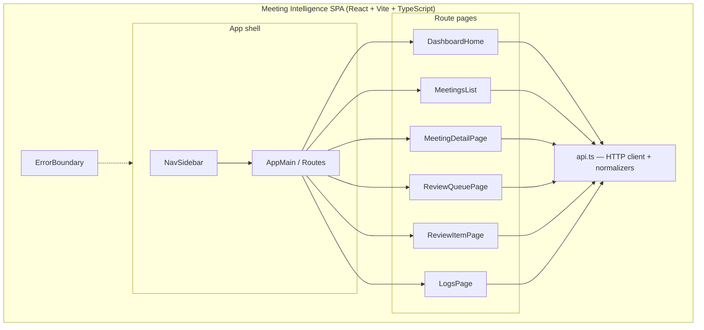
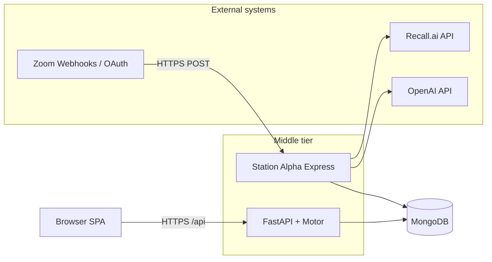
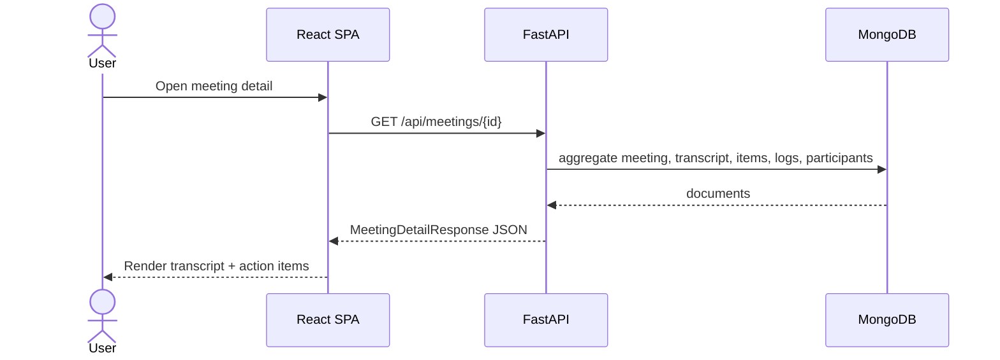
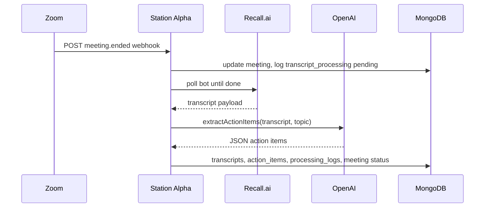

# Chapter 1. Project Design

This chapter describes **important design elements** of Meeting Intelligence that are central to the project: the **client** (operator-facing SPA), the **middle tier** (HTTP API plus event-driven ingest), and the **data tier** (MongoDB). Subsections follow a typical MS Software Engineering layout: client design (with guidance for screenshots and UML), middle-tier design (UML), and data-tier design (schema and data artifacts). Topics are tailored to this repository; add chapters if your report needs more depth.

---

## 1.1 Client design

### 1.1.1 Design goals

The client is a **single-page application** whose primary users are operators and reviewers: they scan meeting activity, open transcripts and metadata, and **approve or correct** model-generated action items before any downstream use. Design priorities:

- **Single API dependency** — All data flows through FastAPI (`/api`); the browser never calls the Zoom ingest service directly, which simplifies CORS and secret handling.
- **Clear navigation** — A persistent sidebar and a small route table keep dashboards, lists, detail, review, and logs one or two clicks apart.
- **Resilience** — A top-level error boundary and explicit `fetch` error handling avoid silent failures when the API is unreachable.

### 1.1.2 Screenshots (to insert in your report)

Capture the running app (`npm run dev` with API and MongoDB) and insert **figures** in your Word/PDF document (Markdown cannot embed your live PNGs here). Suggested captures:

| Figure | Route | What to show |
|--------|--------|----------------|
| **Fig. 1** | `/` | Dashboard: summary metrics and meeting table with filters. |
| **Fig. 2** | `/meetings` | Meeting list with search/sort. |
| **Fig. 3** | `/meetings/:id` | Meeting detail: transcript segments, action items, related links. |
| **Fig. 4** | `/review` | Review queue with pending items. |
| **Fig. 5** | `/review/item/:itemId` | Single-item review with edit/approve/reject. |
| **Fig. 6** | `/logs` | Processing logs with filters. |

**Caption template:** *Figure X — Meeting Intelligence: [screen name]. React + TypeScript client, [date].*

### 1.1.3 UML — high-level client structure (component view)

The following **component diagram** (Mermaid) shows how the SPA is partitioned. Render it in VS Code, GitHub, or [mermaid.live](https://mermaid.live) for export to PNG/SVG for your report.



### 1.1.4 UML — programming structure (simplified class / collaboration view)

React components are functions, not classical classes; this **UML-style class diagram** treats **modules** as design units and shows how **pages** depend on the shared **`api`** facade (accurate to `frontend/src/`).

```mermaid
classDiagram
  class App {
    +render() JSX
  }
  class NavSidebar
  class DashboardHome
  class MeetingsList
  class MeetingDetailPage
  class ReviewQueuePage
  class ReviewItemPage
  class LogsPage
  class api {
    +summary()
    +meetings()
    +meetingDetail()
    +reviewQueue()
    +approveItem()
    +rejectItem()
    +processingLogs()
    +patchMeetingContext()
    +projectsList()
    ... 
  }

  App --> NavSidebar
  App --> DashboardHome : route /
  App --> MeetingsList : route /meetings
  App --> MeetingDetailPage : route /meetings/:id
  App --> ReviewQueuePage : route /review
  App --> ReviewItemPage : route /review/item/:itemId
  App --> LogsPage : route /logs

  DashboardHome --> api
  MeetingsList --> api
  MeetingDetailPage --> api
  ReviewQueuePage --> api
  ReviewItemPage --> api
  LogsPage --> api
```

**Innovation (client):** The **review queue** and **per-item editor** embody human-in-the-loop governance over LLM output; the **normalization helpers** next to `api` keep the UI stable if JSON field names or nullability change slightly on the server.

---

## 1.2 Middle-tier design

The middle tier is **two cooperating services**: (1) **FastAPI** — synchronous request/response for the SPA; (2) **Station Alpha (Express)** — asynchronous **event-driven** processing for Zoom, Recall.ai, and OpenAI, writing the same database.

### 1.2.1 UML — deployment / component diagram



### 1.2.2 UML — sequence: user views a meeting (request-driven)



### 1.2.3 UML — sequence: Zoom meeting ends (event-driven pipeline)



### 1.2.4 FastAPI internal structure (design summary)

Routers under `backend/app/routers/` map to **bounded contexts**: dashboard, projects, meetings, action-items, logs. **Services** encapsulate aggregation and rules; **schemas** define the public contract. **Innovation:** strict separation so **ingest** never has to implement UI-specific aggregations—the API remains the single read model for the client.

### 1.2.5 Station Alpha internal structure (design summary)

**Routes** validate Zoom traffic; **services** isolate Recall HTTP, OpenAI chat completion, Zoom token/meeting API, and **MongoDB writes** (`meetingIntelligenceSync.js`) so orchestration in `zoomWebhooks.js` stays readable. **Innovation:** **salvage paths** that persist a transcript when extraction fails, and structured **processing_logs** for operator visibility.

---

## 1.3 Data-tier design

### 1.3.1 Logical schema (ER diagram)

The canonical **entity-relationship** model is maintained in [`database-schema.md`](./database-schema.md) as Mermaid `erDiagram`. **Include that diagram in your report** (export from Mermaid or paste the figure from the linked file).

Relationships at a glance:

- **projects** → **meetings** (optional `project_id`)
- **meetings** → **transcripts** (one-to-one in practice, unique index on `meeting_id`)
- **meetings** → **action_items**, **processing_logs** (one-to-many)
- **participants** ↔ **meetings** via **meeting_participants**

### 1.3.2 Ingest-specific and operational fields

Beyond the ER diagram narrative, the **application** also relies on:

- **`meetings.zoom_meeting_id`** — Correlates Zoom’s meeting id with MongoDB `_id` for idempotent ingest (sparse unique index in `backend/app/db.py`).
- **`meetings.recall_bot_id`** — Links the Recall bot instance for transcript retrieval after `meeting.ended`.

These fields support the **middle-tier** pipeline; include them in prose or as an appendix table if your ER figure is not updated to show every optional field.

### 1.3.3 Indexes (physical design)

Indexes are created at API startup (`ensure_indexes`) to match query patterns: dashboard filters (time, `processing_status`, `status`), review queries on `action_items.status`, log timelines, and uniqueness constraints for data quality (one transcript per meeting, unique participant per meeting, sparse unique email).

### 1.3.4 Other data elements

- **Related links** — Embedded arrays of `{ title, url }` on projects and optionally meetings (meeting overrides project when non-empty).
- **Transcript segments** — Array of structures with speaker and text for UI rendering and provenance.
- **Action item workflow** — `status` values include `pending_review`, `approved`, `rejected`, and `ticket_created` for analytics; related external ticketing is a future integration (see [`architecture-chapter-4-sections.md`](./architecture-chapter-4-sections.md)).

---

## Cross-references

- Architecture overview: [`system-architecture.md`](./system-architecture.md)
- Implementation detail: [`programming-effort-client-middleware-data-tiers.md`](./programming-effort-client-middleware-data-tiers.md), [`architecture-chapter-6-sections.md`](./architecture-chapter-6-sections.md)
- Testing: [`testing-and-verification.md`](./testing-and-verification.md)
